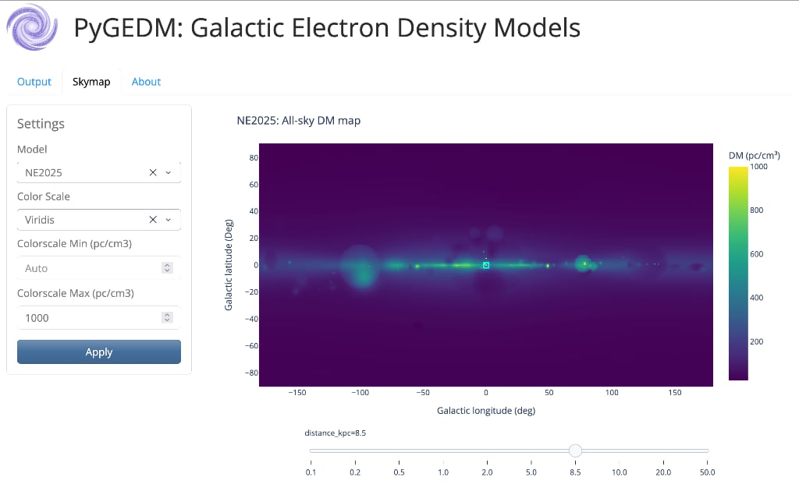

# PyGEDM Web App

A [Plotly Dash](https://dash.plotly.com/) web interface for [PyGEDM](https://github.com/FRBs/pygedm), providing interactive access to Galactic electron density models: **NE2001**, **NE2025**, and **YMW16**.

## Features

- Convert between dispersion measure (DM) and distance for any sky position
- Interactive all-sky DM maps with distance slider
- Supports Galactic (gl, gb) and celestial (RA, DEC) coordinates
- Compare all three models side-by-side

## Running with Docker Compose (recommended)

```bash
docker compose up --build
```

This will build the image and start the app at [localhost:8050](http://localhost:8050).

To run in the background:

```bash
docker compose up -d --build
```

To stop:

```bash
docker compose down
```

### Data file

The app requires `data/gedm_dist_maps.hkl`. If it is present in `app/data/` at build time it will be copied in; otherwise the Dockerfile downloads it automatically from [Zenodo](https://zenodo.org/records/18779007).

The `docker-compose.yml` mounts `./data` into the container at runtime (read-only), so you can replace the data file without rebuilding the image — just restart the container:

```bash
docker compose restart
```

## Running with Docker (manual)

```bash
docker build --tag pygedm_app .
docker run -p 8050:8050 -v "$(pwd)/data:/app/data:ro" pygedm_app
```

## Logs

All startup and request activity is written to stdout, visible via:

```bash
docker compose logs -f
```

Key log messages to look for:

| Message | Meaning |
|---|---|
| `Loading skymap data from …` | Data file read starting |
| `Skymap data loaded in X.XXs (XX.X MB …)` | Successful load with timing |
| `FATAL – could not initialise skymap data` | File missing or corrupt — check `data/` |
| `HDF5 data group keys: …` | Lists actual keys found in the file |

## Screenshots


