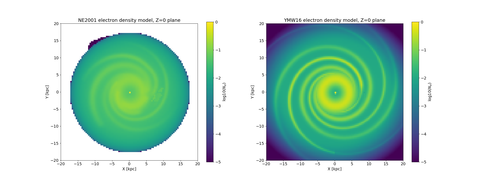
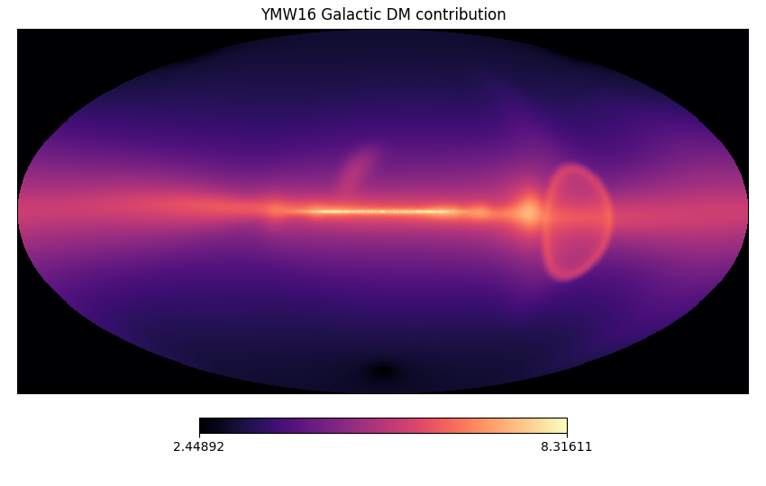
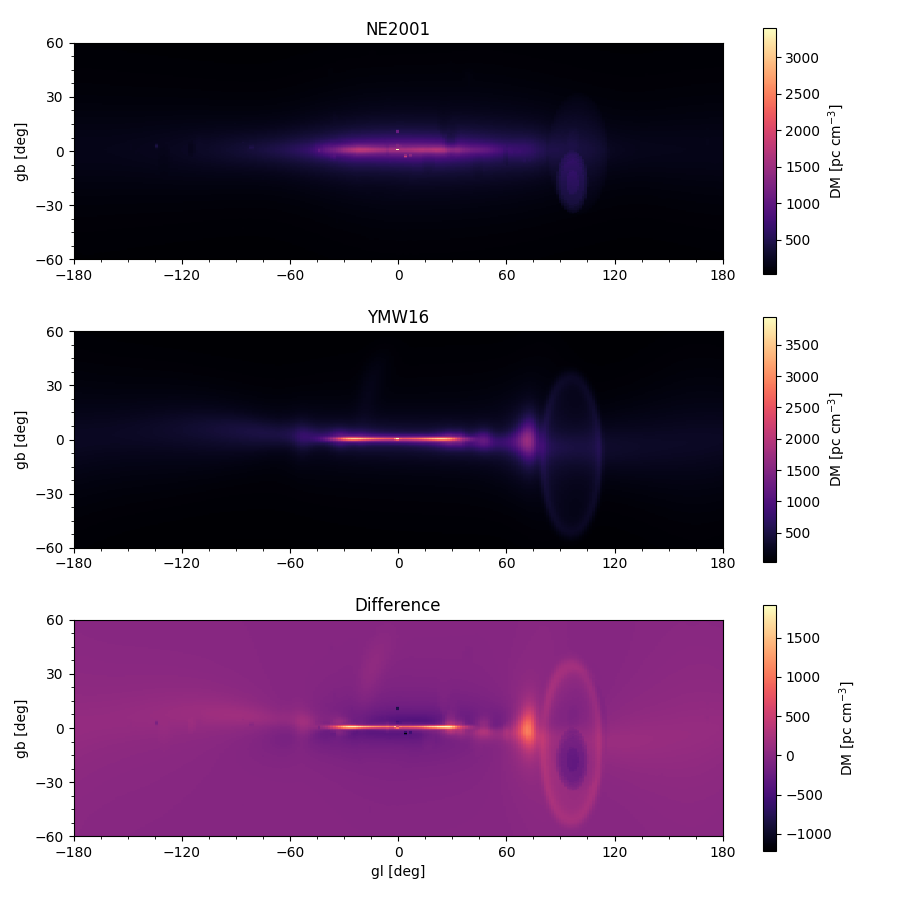

## Examples

#### plot_galaxy_ne.py

Generates a 100x100px image of the galactic plane electron density over
X-Y plane (Z=0)

#### plot_los_dm.py

Computes Galactic DM contribution over galactic latitude/longitudes, out to
a distance of 10,000 pc.

#### create_healpix_map.py

Generates an all-sky healpix map showing galactic DM contribution.

#### compare_to_ne2001.py

Compares output to that of [pyne2001](https://github.com/v-morello/pyne2001) package
(NE2001).

